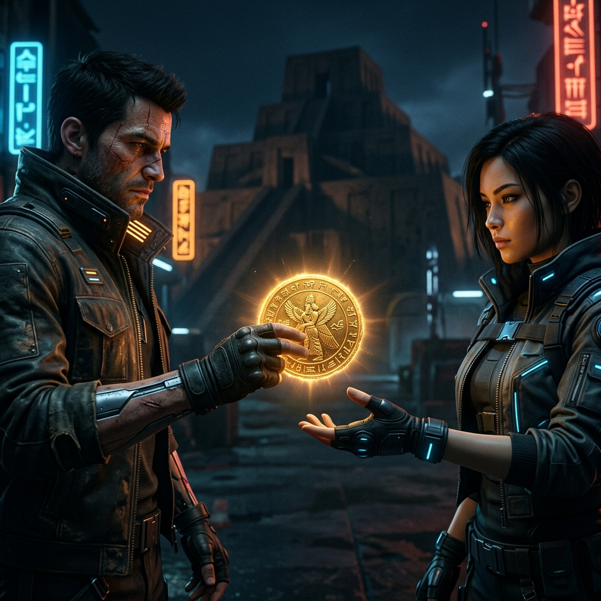

<p align="center">
  
</p>

# 🏛 Numisfera
**El Puente entre el Patrimonio Numismático Tradicional y la Economía Web3.**

[](https://java.com)
[](https://spring.io/projects/spring-boot)
[](https://reactjs.org/)
[](https://docs.soliditylang.org/)
[](https://cloud.google.com/)

Bienvenido al repositorio oficial de **Numisfera**, una plataforma FinTech que revoluciona el coleccionismo numismático mediante certificación digital y subastas descentralizadas apoyadas por Blockchain. 

---

## 🌎 Visión de Negocio (Business Overview)

Históricamente, el coleccionismo e intercambio de piezas de alto valor (como Centenarios, monedas conmemorativas y piezas históricas) se ha enfrentado a retos de **procedencia, escasez de liquidez internacional y falta de confianza entre partes**. 

**Numisfera** resuelve esto mediante la intersección de tecnologías Web2 y Web3:
1. **Digitalización y Certificación (Tokenización):** Las piezas físicas reales se "acuñan" (*mint*) en la red Ethereum como un **NFT (ERC-721)**, adhiriendo inmutabilidad y pruebas absolutas de propiedad e historial sobre cada activo.
2. **Subastas Descentralizadas y Transparentes:** Utilizando _Smart Contracts_, todo el flujo de pujas y retención de fondos se ejecuta mediante código. Numisfera no toca los fondos de los usuarios; actúa como un fiduciario criptográfico que garantiza la transferencia atómica (si pujas y ganas, los fondos van al vendedor y tú recibes los derechos sobre la pieza automáticamante).
3. **Economía de Confianza Cero (*Trustless*):** Se elimina el riesgo de estafas al condicionar el movimiento financiero y patrimonial a una liquidación on-chain inalterable.

### 🌟 Atractivo para Coleccionistas e Inversionistas
- **Exposición Global:** Exhibe y subasta tus piezas ante una audiencia internacional que puede pujar utilizando criptomonedas estándar (ETH).
- **Control Total:** Autenticación fluida utilizando billeteras seguras como MetaMask. Tus activos siguen siendo tuyos hasta que finalice una transacción válida.

---

## 🛠 Arquitectura y Detalles Técnicos (Tech Stack)

Numisfera no es sólo un MVP; es un ecosistema multi-capa de alta madurez diseñado para alta disponibilidad, observabilidad y resiliencia.

### Blockchain (Capa de Liquidación Inmutable)
- Desarrollado en **Solidity** (Framework **Hardhat**).
- **NumisferaNFT:** Contrato Inteligente para certificar piezas únicas (`ERC-721`).
- **NumisferaAuction:** Motor económico autónomo regido por reglas strictas (fechas de expiración con validación `block.timestamp`, devoluciones automáticas a perdedores, liquidación al ganador).

### Backend (The Brain)
Un servicio maestro robusto encargado de la indexación de la cadena, metadatos y seguridad de la API.
- **Java 17 & Spring Boot 3.2**
- **Autenticación Híbrida JWT + Web3:** Un motor propio que desafía criptográficamente al usuario para firmar un mensaje efímero (sin contraseñas) y luego utiliza `Web3j` (EcRecover) para verificar matemáticamente que el firmante posee la llave privada del Wallet, emitiendo posteriormente un _JWT Seguro_ para acelerar peticiones secundarias.
- **Data Persistence:** **MySQL 8** administrado remotamente.
- **Sincronización:** Cron-jobs y Handlers de transacciones aseguran que el catálogo local sea un espejo indexado ultrarrápido del estado de los Smart Contracts en la Blockchain.

### Infraestructura (DevOps & Cloud Native - GCP)
Completamente orquestado dentro de **Google Cloud Platform (GCP)**:
- **Cloud Run (Serverless):** Despliegue en contenedores auto-escalables vía Pipelines de **GitHub Actions** (CI/CD).
- **Google Cloud Storage:** Alojamiento de imágenes de piezas numismáticas de ultra alta definición.
- **Cloud SQL:** Operación transaccional ágil.
- **GCP Observability & Logging:** Implementación avanzada de **Logback Estructurado en JSON**. Inyección de **MDC (Mapped Diagnostic Context)** para trazar el `walletAddress` a través de todos los logs, permitiendo auditorías puntuales de eventos core (`[AUCTION_CREATED]`, `[BID_PLACED]`, etc.) en tiempo real en Logs Explorer.

### Frontend (User Experience)
- **React (Vite):** Arquitectura pura y sin fricciones de UI.
- Integración profunda de estados asíncronos con **Ethers.js v6**. 
- Diseño visual inmersivo (Dark Theme / Glassmorphism) y _Responsive_ en CSS Vanilla con capacidades y soporte para i18n.

---

## ⚙️ Análisis de Arquitectura Adicional

> Para un análisis profundo de la arquitectura de la nube, las integraciones y los flujos Web3 ↔️ Web2, revisa el Diagrama Funcional:
> [👉 Ver architecture_diagram.md](architecture_diagram.md)

---

## 🚀 Instalación y Desarrollo Local

### 1. Iniciar los Smart Contracts
```bash
cd blockchain
npm install
npx hardhat node
```
*En otra terminal despliega los contratos a la blockchain local:*
```bash
npx hardhat run scripts/deploy.js --network localhost
```

### 2. Iniciar el Backend (Java)
Asegúrate de contar con tus variables de entorno locales (DB, llaves de Storage) en tu `application.properties`.
```bash
cd backend
./mvnw spring-boot:run
```

### 3. Iniciar el Frontend
```bash
cd frontend
npm install
npm run dev
```
*Asegúrate de configurar en Metamask la red de desarrollo apuntando a `http://localhost:8545`.*

---
_Creado con visión e innovación técnica. Si eres un reclutador asomándote por aquí, encontrarás código asíncrono limpio híbrido Web2/Web3, seguridad backend implacable y patrones sólidos arquitectónicos. Si eres un usuario o coleccionista, has llegado al estándar de oro._
