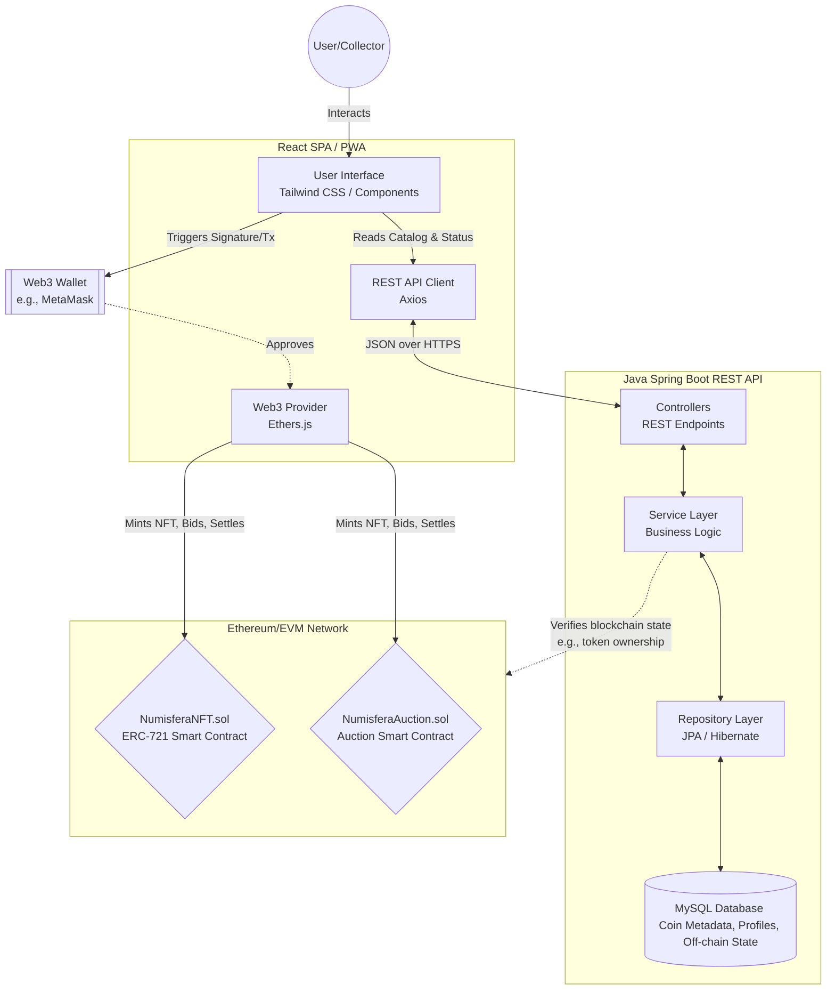

# Numisfera Architecture Diagram

This diagram details the core components of the Numisfera platform: the React Frontend, the Java Spring Boot Backend, and the Ethereum Blockchain Contracts, along with their primary interactions.

## Key Interactions Explained:
1. **Catalog Browsing**: The User interacts with the **Frontend**, which requests coin metadata from the **Backend MySQL Database** via the REST API.
2. **Authentication & Identity**: The User authenticates by connecting their **Web3 Wallet** (MetaMask) via Ethers.js in the frontend.
3. **Minting (Tokenization)**: When a user wants to mint a coin, the Frontend prompts the Web3 Wallet for a signature and sends a transaction to the **NumisferaNFT (ERC-721)** smart contract. At the same time, the off-chain metadata (image URLs, specs, history) remains securely stored in the Backend.
4. **Auctioning**: The user launches an auction via the frontend, communicating directly with the **NumisferaAuction** contract to lock the NFT and set conditions. The Frontend also informs the Backend to reflect the "Active Auction" visually on the site without waiting for purely blockchain reads on every page load.
5. **Settlement**: Upon expiration (handled in UTC using `Instant` on the backend), the winner or owner triggers the smart contract settlement. Once confirmed by the Blockchain, the backend synchronizes the new ownership internally.
